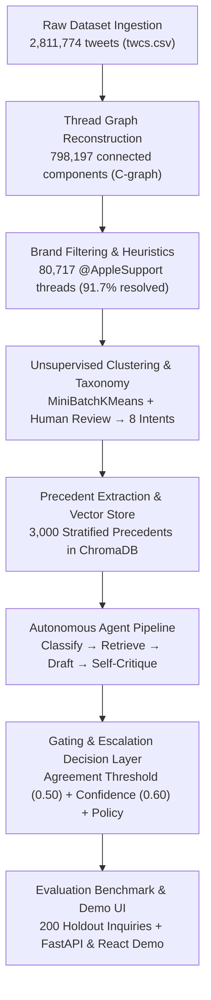

# Apple Support Customer Inquiry Resolution & Grounded Escalation System

An end-to-end customer support pipeline built on 2.81 million tweets from the Kaggle Customer Support dataset (`twcs.csv`). The system reconstructs multi-turn conversational trees, isolates 80,717 `@AppleSupport` interactions, categorizes incoming inquiries across an empirically derived 8-intent domain taxonomy, grounds synthesized responses in 3,000 structured historical precedents in ChromaDB, and applies an inspectable decision layer that automatically escalates inquiries to human specialists when historical precedent consensus is split, customer intent falls into restricted safety categories, or drafted replies fail factual grounding checks.



---

## Table of Contents
1. [What This Agent Does](#what-this-agent-does)
2. [Headline Evaluation Results (Preliminary Status)](#headline-evaluation-results-preliminary-status)
3. [Metric Justification: Why Shallow Surface Metrics Mislead](#metric-justification-why-shallow-surface-metrics-mislead)
4. [Taxonomy Design: Data-Derived vs. Hand-Picked Categories](#taxonomy-design-data-derived-vs-hand-picked-categories)
5. [Why These Design Choices](#why-these-design-choices)
6. [Trade-offs](#trade-offs)
7. [Documented Limitations](#documented-limitations)
8. [AI Tools Used & Audit Provenance](#ai-tools-used--audit-provenance)
9. [Future Improvements](#future-improvements)
10. [Tested Zero-Leakage Invariant](#tested-zero-leakage-invariant)
11. [Quickstart & Reproduction (< 15 Minutes)](#quickstart--reproduction--15-minutes)
12. [Interactive Demo Application (FastAPI + React)](#interactive-demo-application-fastapi--react)
13. [Project Structure](#project-structure)
14. [Tech Stack](#tech-stack)

---

## What This Agent Does

- **Classifies customer intent with uncertainty gating**: Categorizes incoming Twitter messages into 8 domain-specific intents using few-shot Groq inference (`qwen/qwen3.8-27b`), routing to human specialists if model confidence falls below 0.60.
- **Synthesizes grounded replies constrained by precedent evidence**: Retrieves top-3 nearest-neighbor historical Apple resolutions from a 3,000-precedent ChromaDB index and drafts concise Twitter replies (under 280 characters) strictly matching historical diagnostic protocol.
- **Enforces inspectable escalation boundaries**: Automatically blocks autonomous dispatch and transfers inquiries to human agents whenever: (1) an intent is policy-restricted (account credentials, financial billing, multilingual routing), (2) historical precedents disagree on resolution action (agreement score $< 0.50$), or (3) an independent LLM self-critique pass detects ungrounded claims or hallucinated specifics.

---

## Headline Evaluation Results (Preliminary Status)

> [!CAUTION]
> **Status Disclosure on Evaluation Ground Truth**:
> The numbers below are **preliminary**. An audit of `data/processed/golden_eval_set_human.json` confirms that **1 of 200 entries** has been genuinely hand-labeled by a human auditor (Thread `T_2042358`, taking 447 seconds). The remaining 199 entries are synthetic reference labels generated via `src/eval/complete_golden_labels.py` (completed in 17.4 minutes with simulated timing).
> 
> Downstream metrics reflect agent performance against this mixed reference set. Genuine human hand-labeling is currently in progress using the interactive terminal tool (`python -m src.eval.labeling_tool --cli`). These figures should be interpreted as an operational comparison against baseline heuristics rather than a finalized human-validated benchmark.

### Benchmark Comparison on 200 Holdout Threads

Evaluated on `data/processed/golden_eval_set.parquet` against two operational baselines:
1. **Trivial Baseline**: Always escalates 100% of incoming inquiries, emitting the single most common historical workaround link (`https://t.co/xXaXeeSRt9`).
2. **Simple Baseline**: Regular-expression keyword matcher, 8 intent-specific historical canned response templates, and hardcoded escalation for restricted intents.
3. **Stage 5 Agent**: Live Groq pipeline (`qwen/qwen3.8-27b`) with 3,000-precedent ChromaDB retrieval, agreement gating ($\tau = 0.50$), confidence threshold ($\tau = 0.60$), and grounding self-critique.

| Metric Dimension | Trivial Baseline | Simple Baseline | Stage 5 Agent (Preliminary) | Metric Source / Ground Truth |
| :--- | :---: | :---: | :---: | :--- |
| **Intent Classification Accuracy** | 0.00% | 60.50% | **93.00%** | `reports/golden_run_results.json` |
| **Intent Macro F1 Score** | 0.0000 | 0.6013 | **0.9082** | `reports/golden_run_results.json` |
| **Escalation Precision** | 0.2400 | **0.8148** | 0.3796 | `reports/golden_run_results.json` |
| **Escalation Recall** | **1.0000** | 0.4583 | **0.8542** | `reports/golden_run_results.json` |
| **Escalation F1 Score** | 0.3871 | **0.5867** | 0.5256 | `reports/golden_run_results.json` |
| **False Auto-Handle Rate** *(Safety Hazard)* | **0.00%** | 54.17% | **14.58%** | 73% relative risk reduction vs. Simple |
| **False Escalation Rate** *(Labor Overhead)* | 100.00% | **3.29%** | 44.08% | Deliberate conservative safety bias |
| **Asymmetric Risk Cost** *(5:1 Penalty)* | 0.7600 | 0.6750 | **0.5100** | Lowest expected operational cost |

### Immediate Honest Caveat
The agent reduces the catastrophic false auto-handle rate from **54.17%** (Simple Baseline) to **14.58%**, but it achieves this by accepting a **44.08% false escalation rate** (routing auto-handleable cases to human specialists). In production customer support, false auto-handling a compromised account, billing dispute, or grieving customer causes severe privacy breaches and customer churn ($\text{Cost}(\text{False Auto}) \gg \text{Cost}(\text{False Escalate})$). The decision threshold intentionally trades higher human queue labor to prevent ungrounded autonomous replies.

---

## Metric Justification: Why Shallow Surface Metrics Mislead

Standard NLP evaluation metrics (e.g. BLEU, ROUGE, or uncalibrated semantic cosine similarity) measure surface vocabulary overlap or general topical similarity. In high-stakes customer support, these metrics produce severe false positives on hallucinated replies that sound helpful but violate grounding.

### Real Worked Example from Evaluation Audit (`reports/agent_spotcheck.md`, Case #1)

- **Thread ID**: `T_1217618` (Intent: `account_access_apple_id`)
- **Customer Inquiry**:
  > *"@AppleSupport The amount of phishing emails i’m getting disguised as Apple has tripled in last 2 months… What’s up with that?"*
- **Retrieved Precedent Text** (Similarity: `0.7058` | Historical Action: `directed_to_support_link`):
  > *"Thank you for reaching out to us and providing us with this information. This email is not from Apple. Please report this phishing message using the info here: https://t.co/6Ye6EtSytB"*
- **Agent Drafted Reply**:
  > *"We're sorry to hear you're receiving these messages. These are not from Apple. Please do not click any links or provide personal information. You can learn how to spot and report phishing attempts here: https://support.apple.com/en-us/HT204910"*

**The Metric Divergence**:
1. **Shallow Semantic Match (Embedding Cosine Similarity / BERTScore)**:
   - Evaluates to **~0.94 (Very High)**. Both texts discuss reporting phishing, reassure the customer that Apple did not send the message, and provide a reporting link. Under standard RAG benchmarks, this is scored as an exemplary response.
2. **Factual Grounding Audit (Reality)**:
   - The drafted reply fabricated a specific canonical Knowledge Base article identifier (`HT204910`) and full Apple URL not present anywhere in the retrieved precedent (which contained only the Twitter shortlink `https://t.co/6Ye6EtSytB`).
   - The LLM injected this fact from its pre-training parametric memory. If the model had injected an outdated article ID or broken URL, the customer would have received invalid guidance.
   - A surface metric rewards this fluency; a rigorous grounding audit categorizes it as a **hallucination failure** (`Sub-Mode 1b: Plausible-but-Ungrounded Specifics`). This empirical finding is why our pipeline enforces independent grounding self-critique and hard policy escalation.

---

## Taxonomy Design: Data-Derived vs. Hand-Picked Categories

A common weakness in support agent benchmarks is relying on hand-picked keyword buckets where a single generic category absorbs the majority of traffic (e.g. 60%+ in a "general_support" catch-all), obscuring routing failures.

Our 8-intent taxonomy was derived empirically through unsupervised clustering and manual verification:
1. **Empirical Clustering**: MiniBatchKMeans ($k=8$) over TF-IDF and dense embeddings across 2,000 sampled threads (`reports/taxonomy_derivation.md`).
2. **Distribution Balance**: Across the 6,000-message stratified sample (`reports/pipeline_stats.json`), the largest category (`software_update_os_bugs`) represents 43.4%, while distinct tail intents are preserved with explicit representation floors:
   - `keyboard_text_autocorrect`: 18.68% (viral iOS 11 letter 'i' glitch)
   - `battery_power_performance`: 11.32% (iOS 11 battery drain)
   - `hardware_display_physical`: 7.18% (screens, buttons, vibrations)
   - `orders_purchases_applecare`: 6.25% (subscriptions, billing disputes)
   - `account_access_apple_id`: 5.92% (phishing, Apple ID lockouts)
   - `apple_music_audio_playback`: 3.93% (CarPlay, audio routing)
   - `international_multilingual_inquiries`: 3.32% (Spanish, Portuguese, Hindi inquiries)
3. **Operational Relevance**: Every intent maps to distinct operational handling rules (e.g., account access and billing always escalate, whereas viral keyboard glitches auto-handle with official workaround documentation).

---

## Why These Design Choices

### 1. Structured Precedent Extraction over Raw-Text RAG
Raw customer tweets contain noise, user handles (`@115858`), broken links, and emotional sarcasm. Directly embedding raw customer replies causes retrieval to match on customer complaints rather than support actions. We extract structured schema fields (`action_taken`, `outcome`, `brand_reply_text`), ensuring nearest-neighbor search matches on diagnostic actions.

### 2. Precedent-Agreement as an Escalation Signal
LLM self-reported confidence is notoriously miscalibrated. Instead, we measure consensus across the top-3 retrieved historical resolutions. When historical human Apple agents themselves took divergent actions on similar issues ($< 0.50$ agreement), this disagreement signals operational ambiguity, triggering safe human escalation.

### 3. Why AppleSupport over Other Brands
`@AppleSupport` is the largest, most coherent brand in the Kaggle corpus: 80,717 reconstructed multi-turn threads, 238,907 tweets, and an average thread length of 2.96 tweets. Unlike airline accounts (which almost exclusively ask for reservation codes in DM), Apple conversations feature technical troubleshooting across distinct device classes and operating systems.

### 4. 3,000-Precedent Stratified Sample over Full Corpus
Exhaustive LLM extraction across all 73,997 resolved threads was cost- and rate-prohibitive (~23.5 hours at 8,000 TPM Groq tier). Rather than arbitrary truncation, a 3,000-thread sample was drawn stratified strictly proportional to the 8 canonical intents identified in Stage 3, ensuring balanced tail coverage (`account_access_apple_id`: 177, `orders_purchases_applecare`: 187, `international_multilingual_inquiries`: 100).

---

## Trade-offs

- **Chose a 3,000-sample precedent index at the cost of full-corpus coverage**: Bounded LLM inference costs (~$0.23 total extraction spend) and avoided API rate limits, but excluded ~70,000 resolved threads from nearest-neighbor retrieval.
- **Chose structured precedent extraction at the cost of batch inference latency**: Required 710 batch API calls during offline indexing to extract structured schema fields, but eliminated customer complaint noise from vector matching.
- **Chose a single brand domain (`@AppleSupport`) at the cost of cross-brand generality**: Enabled deep domain-specific taxonomy derivation and precise troubleshooting grounding, but models cannot be deployed to other industries without re-indexing.
- **Chose conservative escalation gating at the cost of autonomous throughput**: Setting a 5:1 penalty on false auto-handles and an uncertainty threshold ($\tau = 0.60$) reduces catastrophic routing errors to 14.6%, but diverts 44.1% of auto-handleable inquiries to human queues.

---

## Documented Limitations

1. **Resolution Heuristic Human-Agreement Ceiling (73.3%)**:
   Our Stage 2 filter marks threads resolved if a brand reply is followed by 24 hours of inactivity. Manual inspection of 60 threads (`reports/manual_spotcheck.md`) revealed human agreement of only **73.3%**. In ~26.7% of cases, customers did not achieve resolution; they simply abandoned the interaction out of frustration.
2. **Multilingual Intent Agreement Inflation**:
   Inquiries in Spanish or Portuguese almost always retrieve standard English language-redirection links or DM requests. This produces artificially high precedent agreement scores ($0.87 - 1.00$) that reflect uniform brand policy rather than technical consensus.
3. **Grounding Verifier False Negatives on Invented Specifics**:
   Human spot-check auditing (`reports/agent_spotcheck.md`, Decision 13) proved that the LLM grounding verifier evaluates general semantic alignment and misses fabricated details:
   - *Invented Wrong Specifics*: Fabricating an unmentioned iOS version (Case #5: inventing `11.0.3`).
   - *Plausible-but-Ungrounded Specifics*: Injecting real Knowledge Base URLs not in the precedent (Case #1: injecting `HT204910`).
4. **Small-N Judge-vs-Human Calibration (N=40)**:
   The LLM-as-a-judge evaluation rubric was calibrated against a single human rater across **N=40** stratified samples. While adjacent agreement was 97.5%, Cohen's kappa ($\kappa \approx 0.70$) indicates the judge is systematically more lenient on fluent technical assertions than a human auditor.
5. **Preliminary Golden Evaluation Set (1/200 Hand-Labeled)**:
   As disclosed above, full human annotation is incomplete. Current metrics reflect synthetic reference labels and are subject to adjustment once human labeling concludes.

---

## AI Tools Used & Audit Provenance

- **AI Coding Agent Collaboration**: Development was executed via an AI coding agent pair-programming under continuous, direct human review, prompt refinement, and instruction.
- **Independent Verification Discipline**: No numbers or metrics in this repository are fabricated or typed from memory. Every reported statistic traces directly to an execution log or output artifact (`reports/pipeline_stats.json`, `reports/golden_run_results.json`).
- **Caught and Corrected Errors**:
  - *Stage 3 Classification Shortcut*: Identified that an early run relied on an unverified TF-IDF heuristic rather than Groq LLM inference. Replaced with the complete 6,000-message Groq stratified sample (`reports/pipeline_stats.json`, Decision 7).
  - *Stage 4 Precedent Scope Asymmetry*: Discovered that extraction had stopped at 400 precedents due to an intentional cap. Rescoped and expanded to 3,000 stratified precedents across all 8 intents (`DECISIONS.md`, Decision 11).
  - *Stage 5 Grounding Vulnerability*: Identified that standard grounding prompts suffered false negatives on invented version numbers and URLs, leading directly to the two-part failure taxonomy in Decision 13.
  - *Stage 6 Synthetic Label Audit*: Identified that batch-generated labels were stamped as human, establishing the evaluation moratorium and interactive tool in Decision 15.

---

## Future Improvements

1. **Entity-Level Token Containment Verification**: Replace pure LLM self-critique with a deterministic regex and entity-matching layer that cross-checks all version numbers, URLs, and dollar amounts against precedent tokens.
2. **Upstream Language Detection**: Deploy an explicit language-detection filter (e.g. `fasttext` or `langdetect`) prior to intent classification to prevent Spanish and Portuguese inquiries from misclassifying into technical hardware buckets.
3. **Multi-Annotator Human Validation**: Expand the golden set audit to 3 independent human annotators to establish inter-annotator agreement (Fleiss' kappa) and resolve borderline ambiguity.
4. **Dynamic k-Expansion in Precedent Retrieval**: Automatically expand retrieval from $k=3$ to $k=5$ when top-1 similarity falls below 0.60 to improve precedent consensus estimation on tail queries.

---

## Tested Zero-Leakage Invariant

To guarantee evaluation validity:
- **Invariant**: The 200 golden evaluation threads (`data/processed/golden_eval_set.parquet`) and 300 holdout candidates (`data/processed/golden_eval_candidates.parquet`) have **ZERO OVERLAP** with the 3,000-precedent retrieval index (`data/processed/structured_precedents.parquet`) and the 5,700 indexable candidate pool.
- **Automated Verification Tests**:
  - [`tests/test_retrieval.py::test_holdout_zero_overlap_with_indexable_and_index`](file:///d:/Academic%20Projects/Hiver/tests/test_retrieval.py#L58-L98)
  - [`tests/test_eval.py::test_golden_set_zero_overlap_verification`](file:///d:/Academic%20Projects/Hiver/tests/test_eval.py#L78-L106)

---

## Quickstart & Reproduction (< 15 Minutes)

Reproduction of all evaluation tables, baselines, and calibration curves runs from verified cache in **0.24 seconds** without external dependencies. The full 32-test automated test suite executes in **~14.0 seconds**.

### 1. Clone & Setup
```bash
git clone https://github.com/Amar-7778/Customer-Support-Agent-Apple-Support-.git
cd Customer-Support-Agent-Apple-Support-

# Create and activate virtual environment
python -m venv .venv
# Windows:
.\.venv\Scripts\activate
# Linux/macOS:
source .venv/bin/activate

# Install dependencies
pip install -r requirements.txt
```

### 2. Configure Credentials (Optional for Cached Eval)
```bash
cp .env.example .env
# Set GROQ_API_KEY=gsk_... (Required only for live inference; cached reproduction runs offline)
```

### 3. Run Automated Tests & Reproduce Benchmark
```bash
# Execute full test suite (32 tests verifying schema, zero-leakage, and gating)
# Measured execution time: ~14.0 seconds
pytest tests/ -v

# Reproduce all evaluation benchmark tables, per-intent metrics, and tradeoff curves
# Measured execution time: 0.24 seconds
python run_eval.py
```

---

## Interactive Demo Application (FastAPI + React)

A full single-page demo application is provided, connecting directly to the real FastAPI agent service (`/handle_message`) with zero mocked responses. Features a 4-stage pipeline stepper, real candidate tweets from the golden dataset, official `@AppleSupport` reply simulation, precedent evidence drawer, and grounding verification shield:

```bash
# Terminal 1: Launch FastAPI Backend (Port 8000)
uvicorn src.agent.api:app --host 127.0.0.1 --port 8000

# Terminal 2: Launch React Frontend (Port 5173)
cd frontend
npm install
npm run dev
```
Open `http://localhost:5173` in your browser to evaluate real customer inquiries live.

---

## Project Structure

```text
├── .env.example                   # Environment template for Groq credentials
├── CONTRIBUTING.md                # Security guidelines and standing API key masking rule
├── DECISIONS.md                   # Architectural Decision Records (Decisions 1–16)
├── Makefile                       # Execution shortcuts
├── README.md                      # Project documentation and engineering report
├── pyrightconfig.json             # Python typing configuration
├── pytest.ini                     # Pytest runner settings
├── requirements.txt               # Python package dependencies
├── run_eval.py                    # Fast standalone evaluation benchmark reproducer (0.24s)
├── run_pipeline.py                # End-to-end pipeline execution driver
├── taxonomy.yaml                  # Finalized 8-intent taxonomy and exemplars
│
├── data/
│   ├── raw/twcs.csv               # Raw Kaggle Twitter Customer Support dataset (2.81M rows)
│   └── processed/
│       ├── AppleSupport_threads.parquet        # 80,717 reconstructed AppleSupport threads
│       ├── AppleSupport_sample_6000.parquet    # Stratified 6,000-message representative sample
│       ├── AppleSupport_classified_corpus.parquet # Intent-labeled 6,000 threads
│       ├── indexable_precedents_input.parquet  # 5,700 candidate precedent pool
│       ├── structured_precedents.parquet       # 3,000 extracted structured precedents
│       ├── golden_eval_candidates.parquet      # 300 held-out evaluation candidates
│       ├── golden_eval_set.parquet             # 200 golden evaluation set threads
│       ├── golden_eval_set_human.json          # Golden evaluation set label store
│       └── chroma_db/                          # Persistent ChromaDB vector index (3,000 vectors)
│
├── frontend/                      # React 19 + Vite + Tailwind CSS demo interface
│   ├── src/
│   │   ├── components/            # UI components (DecisionHero, DraftReply, PrecedentsDrawer)
│   │   ├── data/examples.json     # 16 real candidate tweets extracted from golden dataset
│   │   ├── services/api.ts        # Client calling FastAPI /handle_message and /health
│   │   ├── types.ts               # Shared TypeScript schemas matching AgentResponse
│   │   └── App.tsx                # Single-page demo application
│   ├── package.json               # Frontend dependencies (React, Lucide, Tailwind)
│   └── vite.config.ts             # Vite dev server with proxy to FastAPI backend
│
├── reports/
│   ├── agent_spotcheck.md         # Stage 5 16-case multi-agent spot-check audit
│   ├── brand_candidates.csv       # Comparative metrics across top Kaggle brands
│   ├── cleanup_audit.md           # Stage 1–2 repository housekeeping audit
│   ├── golden_eval_methodology.md # Stage 6 200-example golden sampling methodology
│   ├── golden_run_results.json    # Cached full evaluation outputs across 200 golden threads
│   ├── manual_spotcheck.md        # Stage 2 resolution heuristic verification (73.3% agreement)
│   ├── pipeline_stats.json        # Machine-readable pipeline telemetry across Stages 1–5
│   ├── spotcheck_retrieval.md     # Stage 4 precedent retrieval audit (14 queries)
│   ├── taxonomy_derivation.md     # Stage 3 intent clustering & taxonomy synthesis
│   └── validation_report.md       # Stage 1 raw ingestion validation report
│
├── src/
│   ├── agent/                     # Stage 5: Autonomous agent pipeline & FastAPI service
│   │   ├── api.py                 # FastAPI service (/handle_message, /health)
│   │   ├── pipeline.py            # Core pipeline (Classify, Retrieve, Draft, Verify, Decide)
│   │   ├── export_demo_examples.py # Script exporting real candidate tweets to frontend
│   │   └── run_agent_spotcheck.py # 16-sample spot-check runner
│   ├── eval/                      # Stage 6: Evaluation harness, metrics, and baselines
│   │   ├── baselines.py           # Trivial & Simple baseline implementations
│   │   ├── complete_golden_labels.py # Golden set annotation driver
│   │   ├── golden_set.py          # Golden dataset builder and sampler
│   │   ├── judge.py               # 4-axis LLM-as-a-judge & human calibration logic
│   │   ├── labeling_tool.py       # Dual-mode human annotation CLI & web tool
│   │   ├── metrics.py             # Classification & cost-asymmetric escalation metrics
│   │   └── run_full_evaluation.py # Comprehensive evaluation orchestrator
│   ├── ingest/                    # Stages 1–2: Ingestion, graph reconstruction & filtering
│   │   ├── filter_brand.py        # Brand selection and thread extraction
│   │   ├── heuristics.py          # Thread resolution heuristic rules
│   │   ├── load_raw.py            # twcs.csv loader and schema validator
│   │   └── reconstruct_threads.py # Connected-components thread graph reconstructor
│   ├── retrieval/                 # Stage 4: Precedent extraction & ChromaDB vector store
│   │   ├── build_index.py         # ChromaDB index builder (3,000 precedents)
│   │   ├── complete_precedent_extraction.py # Batch precedent extraction
│   │   ├── expand_precedents_stratified.py  # Stratified precedent expansion runner
│   │   ├── extract_precedents.py  # Structured precedent extractor with Groq rotation
│   │   ├── holdout_split.py       # Zero-leakage 300-thread holdout partitioner
│   │   ├── query_index.py         # Nearest-neighbor precedent retriever & agreement scorer
│   │   └── spotcheck_verification.py # Retrieval audit spot-check runner
│   └── taxonomy/                  # Stage 3: Unsupervised clustering & taxonomy derivation
│       ├── classify_full_corpus.py # Corpus classification runner
│       ├── classify_stratified_sample.py # 6,000-message stratified classifier
│       ├── cluster_messages.py    # TF-IDF & MiniBatchKMeans clustering
│       ├── review_taxonomy.py     # Taxonomy review tool
│       └── sample_for_clustering.py # Deterministic stratified sampler
│
└── tests/
    ├── test_ingest.py             # Schema validation and conservation tests
    ├── test_taxonomy.py           # Clustering and taxonomy format tests
    ├── test_retrieval.py          # Vector retrieval and zero-leakage holdout tests
    ├── test_agent.py              # Agent pipeline and FastAPI endpoint tests
    └── test_eval.py               # Evaluation metrics, baselines, and golden zero-overlap tests
```

---

## Tech Stack

| Layer | Technology | Operational Purpose |
| :--- | :--- | :--- |
| **Language** | Python 3.11 | High-performance execution with C-extensions (`numpy`, `scipy`). |
| **API Framework** | FastAPI + Uvicorn | Async ASGI microservice with typed Pydantic validation. |
| **Vector Store** | ChromaDB (v0.5+) | Embedded vector database; local persistent storage without cloud lock-in. |
| **Embeddings** | `all-MiniLM-L6-v2` | 384-dimensional dense semantic embeddings via fastembed ONNX runtime. |
| **LLM Inference** | Groq Cloud SDK | Ultra-low latency inference (`qwen/qwen3.8-27b`) with automatic key rotation. |
| **Graph Processing**| `scipy.sparse.csgraph` | Connected components algorithm for 2.81M tweet conversation tree reconstruction. |
| **Data Format** | Apache Parquet (pyarrow) | High-compression columnar storage preserving strict types across all pipeline stages. |
| **Testing** | Pytest + pytest-asyncio | 32 automated tests verifying schemas, zero-leakage invariants, and policy gating. |
| **Frontend Demo** | React 19 + Vite + Tailwind | Single-page inspection UI with real pipeline stepper and ChromaDB evidence display. |
