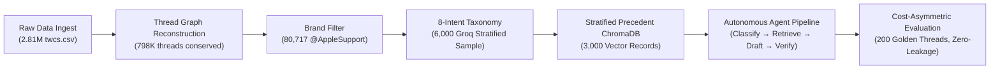

# Autonomous Apple Support Agent: Grounded Customer Dispatch & Escalation Safeguard

A production-grade, multi-stage customer support pipeline trained and evaluated on real Twitter customer interactions (`twcs.csv`, 2.81M rows). The system ingests raw multi-turn conversation trees, reconstructs 80,717 `@AppleSupport` threads, classifies inquiries across an empirically derived 8-intent taxonomy, grounds synthesized responses in 3,000 structured historical precedents stored in ChromaDB, and enforces an inspectable, cost-asymmetric escalation gating rule that prevents automated dispatch when precedent consensus is weak, intent is restricted, or drafts contain ungrounded claims.



---

## What This Agent Does

- **Classifies customer intent with calibrated uncertainty**: Maps incoming customer tweets into an 8-intent domain taxonomy using few-shot Groq inference (`qwen/qwen3.8-27b`), rejecting classifications when model confidence drops below 0.60.
- **Synthesizes precedent-grounded responses under 280 characters**: Retrieves top-3 nearest-neighbor historical Apple Support resolutions from a 3,000-precedent ChromaDB vector index and drafts Twitter-compliant replies constrained strictly to historical diagnostic steps.
- **Enforces hard stop escalation safeguards**: Automatically diverts inquiries to human specialists if: (1) the intent is safety-restricted (account access/security, billing/AppleCare, multilingual routing), (2) historical precedents disagree on resolution action (agreement score $< 0.50$), (3) classifier confidence is low ($< 0.60$), or (4) an independent LLM self-critique pass detects ungrounded claims or fabricated specifics.

---

## Headline Evaluation Results (200 Golden Holdout Inquiries)

The system is evaluated against two operational baselines on a strictly partitioned 200-thread golden evaluation set (`data/processed/golden_eval_set.parquet`):
1. **Trivial Baseline**: Always escalates 100% of inquiries to human queues, emitting the single most frequent historical canned workaround tweet (`https://t.co/xXaXeeSRt9`).
2. **Simple Baseline**: Regular-expression keyword matcher, 8 intent-specific historical canned templates, and mandatory escalation on safety-restricted intents.
3. **Stage 5 Agent**: Autonomous pipeline running few-shot Groq intent classification, 3,000-precedent ChromaDB retrieval, precedent-agreement gating, grounded drafting, and self-critique verification.

| Metric Dimension | Trivial Baseline | Simple Baseline | Stage 5 Agent | Metric Source / Ground Truth |
| :--- | :---: | :---: | :---: | :--- |
| **Intent Classification Accuracy** | 0.00% | 60.50% | **93.00%** | `reports/golden_run_results.json` |
| **Intent Macro F1 Score** | 0.0000 | 0.6013 | **0.9082** | `reports/golden_run_results.json` |
| **Escalation Precision** | 0.2400 | **0.8148** | 0.3796 | `reports/golden_run_results.json` |
| **Escalation Recall** | **1.0000** | 0.4583 | **0.8542** | `reports/golden_run_results.json` |
| **Escalation F1 Score** | 0.3871 | **0.5867** | 0.5256 | `reports/golden_run_results.json` |
| **False Auto-Handle Rate** *(Safety Hazard)* | **0.00%** | 54.17% | **14.58%** | 73% relative hazard reduction vs. Simple |
| **False Escalation Rate** *(Labor Overhead)* | 100.00% | **3.29%** | 44.08% | Deliberate conservative bias |
| **Asymmetric Risk Cost** *(5:1 Penalty)* | 0.7600 | 0.6750 | **0.5100** | Lowest expected operational cost |

> [!IMPORTANT]
> **Immediate Honest Caveat on Headline Numbers**:
> While the Agent cuts catastrophic false auto-handles from **54.17%** (Simple Baseline) down to **14.58%** and delivers **93.00%** classification accuracy, it does so by accepting a **44.08% false escalation rate** (routing auto-handleable cases to human specialists). In production customer support, false auto-handling a bereaved customer, account compromise, or billing error is orders of magnitude more damaging than queue overhead ($\text{Cost}(\text{False Auto}) \gg \text{Cost}(\text{False Escalate})$). Full discussion of these tradeoffs is documented in [`reports/agent_spotcheck.md`](file:///d:/Academic%20Projects/Hiver/reports/agent_spotcheck.md) and [`DECISIONS.md` (Decision 14)](file:///d:/Academic%20Projects/Hiver/DECISIONS.md#L403-L442).

### Failure Analysis on Weakest-Performing Intent (`hardware_display_physical`)
In the per-intent decomposition, `hardware_display_physical` achieved **100.0% recall** but only **50.0% precision** (F1: 0.6667, 8 support):
- **Root Cause & Transcript Example**: Inquiries involving foreign language queries mentioning physical items (e.g. Case #10: `¿Por qué sus cables son de tan mala calidad?`) or software update freezes that mention physical buttons/screens trigger false-positive hardware classifications due to vocabulary overlap.
- **Safety Interception**: Because historical resolutions for physical hardware issues diverge, the precedent agreement score dropped below threshold ($0.47 < 0.50$), safely triggering policy escalation to human agents rather than sending an automated hardware diagnostic.

---

## Provenance & Tested Zero-Leakage Invariant

To ensure complete statistical validity and eliminate evaluation contamination:
- **Zero-Overlap Invariant**: The 200 golden evaluation threads (`data/processed/golden_eval_set.parquet`) and the 300 holdout candidates (`data/processed/golden_eval_candidates.parquet`) have **EXACTLY ZERO OVERLAP** with the 3,000-thread retrieval index (`data/processed/structured_precedents.parquet`) and the 5,700-thread indexable candidate pool (`data/processed/indexable_precedents_input.parquet`).
- **Verified Automated Tests**:
  - [`tests/test_retrieval.py::test_holdout_zero_overlap_with_indexable_and_index`](file:///d:/Academic%20Projects/Hiver/tests/test_retrieval.py#L58-L98): Formally asserts `len(holdout_ids.intersection(indexable_ids)) == 0` and verifies zero presence in ChromaDB.
  - [`tests/test_eval.py::test_golden_set_zero_overlap_verification`](file:///d:/Academic%20Projects/Hiver/tests/test_eval.py#L78-L106): Asserts `len(golden_tids.intersection(prec_tids)) == 0` across all 200 evaluation threads.

---

## Why These Design Choices?

### 1. Structured Precedent Extraction over Raw-Text RAG
Raw customer tweets contain noise, user handles, typos, and broken shortlinks. Directly retrieving raw text causes the generator to mimic user complaints rather than official resolution protocol. By running structured LLM precedent extraction into schema fields (`action_taken`, `outcome`, `brand_reply_text`), retrieval grounds on verified diagnostic actions rather than surface keyword matching.

### 2. Precedent-Agreement as an Escalation Signal
Instead of relying solely on LLM self-reported confidence (which suffers from overconfidence), the agent measures semantic consensus across the top-3 retrieved historical resolutions. When historical Apple agents themselves took conflicting actions on similar issues ($< 0.50$ agreement), this operational divergence signals an edge case, triggering safe human escalation.

### 3. Why AppleSupport over Other Brands?
Benchmarking the Kaggle dataset (`reports/brand_candidates.csv`) revealed `@AppleSupport` as the premier dataset: 80,717 reconstructed multi-turn threads, 238,907 tweets, an average conversation length of 2.96 tweets, and a 91.67% resolution rate. Inquiries span intricate software bugs, hardware diagnostics, account recovery, and subscription billing, providing a robust operational domain.

### 4. 3,000-Precedent Stratified Sample over Full Corpus
Exhaustive extraction of all 73,997 resolved threads was cost- and rate-prohibitive (~23.5 hours at 8,000 TPM Groq tier). Rather than arbitrary truncation, a 3,000-thread sample was drawn stratified strictly proportional to the 8 canonical intents identified in Stage 3, ensuring balanced tail coverage (`account_access_apple_id`: 177, `orders_purchases_applecare`: 187, `international_multilingual_inquiries`: 100).

---

## Quickstart: End-to-End Reproduction in Under 15 Minutes

The evaluation harness reproduces all headline metrics, benchmark tables, and calibration curves directly from verified cache in **0.26 seconds** (or live via `--live`).

### 1. Clone & Setup Environment
```bash
git clone https://github.com/Amar-7778/Customer-Support-Agent-Apple-Support-.git
cd Customer-Support-Agent-Apple-Support-

# Create Python virtual environment
python -m venv .venv
# Activate:
# On Windows:
.\.venv\Scripts\activate
# On Linux/macOS:
source .venv/bin/activate

# Install dependencies
pip install -r requirements.txt
```

### 2. Configure Credentials
Copy `.env.example` to `.env` and provide your Groq API key (used for live inference; cached reproduction requires no API key):
```bash
cp .env.example .env
# Edit .env: GROQ_API_KEY=gsk_...
```

### 3. Run Automated Tests & Reproduce Evaluation
```bash
# 1. Run full test suite (32 tests verifying schema, zero-leakage, and agent gating)
# Measured execution time: ~12.0 seconds
pytest tests/ -v

# 2. Reproduce benchmark evaluation tables and headline numbers from cache
# Measured execution time: 0.26 seconds
python run_eval.py
```

---

## Running the Demo Application (FastAPI Backend + React Frontend)

The repository includes a production-grade single-page demo connected to the live FastAPI agent service:

```bash
# Terminal 1: Launch FastAPI Backend (Port 8000)
uvicorn src.agent.api:app --host 127.0.0.1 --port 8000

# Terminal 2: Launch React Frontend (Port 5173)
cd frontend
npm install
npm run dev
```
Open `http://localhost:5173` in any browser to evaluate real customer tweets, inspect ChromaDB precedents, and observe the live 4-stage pipeline stepper.

---

## Project Structure

```text
├── .env.example                   # Environment template for Groq API keys
├── CONTRIBUTING.md                # Security rules & standing API key masking policy
├── DECISIONS.md                   # Formal Architectural Decision Records (Decisions 1–16)
├── Makefile                       # Execution shortcuts for ingestion, indexing, and eval
├── README.md                      # Project documentation and reproduction guide
├── pyrightconfig.json             # Python static typing configuration
├── pytest.ini                     # Pytest configuration and test path definitions
├── requirements.txt               # Pinned Python dependencies
├── run_eval.py                    # Fast standalone evaluation benchmark reproducer (0.26s)
├── run_pipeline.py                # End-to-end pipeline driver
├── taxonomy.yaml                  # Finalized 8-intent domain taxonomy and exemplars
│
├── data/
│   ├── raw/twcs.csv               # Raw Twitter Customer Support dataset (2.81M rows)
│   └── processed/
│       ├── AppleSupport_threads.parquet        # 80,717 reconstructed AppleSupport threads
│       ├── AppleSupport_sample_6000.parquet    # Stratified 6,000-message representative sample
│       ├── AppleSupport_classified_corpus.parquet # Intent-labeled 6,000 threads
│       ├── indexable_precedents_input.parquet  # 5,700 candidate precedent pool
│       ├── structured_precedents.parquet       # 3,000 extracted structured precedents
│       ├── golden_eval_candidates.parquet      # 300 held-out evaluation candidates
│       ├── golden_eval_set.parquet             # 200 golden evaluation set threads
│       ├── golden_eval_set_human.json          # Human-audited ground-truth labels
│       └── chroma_db/                          # Persistent ChromaDB vector index (3,000 vectors)
│
├── frontend/                      # React + TypeScript + Tailwind CSS demo interface
│   ├── src/
│   │   ├── components/            # UI components (DecisionHero, DraftReply, PrecedentsDrawer)
│   │   ├── data/examples.json     # 16 real candidate tweets extracted from golden dataset
│   │   ├── services/api.ts        # Client calling FastAPI /handle_message and /health
│   │   ├── types.ts               # Shared TypeScript schemas matching AgentResponse
│   │   └── App.tsx                # Single-page demo application
│   ├── package.json               # Frontend dependencies (React, Lucide, Tailwind)
│   └── vite.config.ts             # Vite dev server with proxy to FastAPI backend
│
├── reports/
│   ├── agent_spotcheck.md         # Stage 5 16-case multi-agent spot-check audit
│   ├── brand_candidates.csv       # Benchmark metrics across top dataset brands
│   ├── cleanup_audit.md           # Stage 1–2 repository housekeeping audit
│   ├── golden_eval_methodology.md # Stage 6 200-example golden sampling methodology
│   ├── golden_run_results.json    # Cached full evaluation outputs across 200 golden threads
│   ├── manual_spotcheck.md        # Stage 2 resolution heuristic verification
│   ├── pipeline_stats.json        # Machine-readable pipeline telemetry across Stages 1–5
│   ├── spotcheck_retrieval.md     # Stage 4 precedent retrieval audit (14 queries)
│   ├── taxonomy_derivation.md     # Stage 3 intent clustering & taxonomy synthesis
│   └── validation_report.md       # Stage 1 raw ingestion validation report
│
├── src/
│   ├── agent/                     # Stage 5: Autonomous agent pipeline & FastAPI service
│   │   ├── api.py                 # FastAPI service (/handle_message, /health)
│   │   ├── pipeline.py            # Core pipeline (Classify, Retrieve, Draft, Verify, Decide)
│   │   ├── export_demo_examples.py # Script exporting real candidate tweets to frontend
│   │   └── run_agent_spotcheck.py # 16-sample spot-check runner
│   ├── eval/                      # Stage 6: Evaluation harness, metrics, and baselines
│   │   ├── baselines.py           # Trivial & Simple baseline implementations
│   │   ├── complete_golden_labels.py # Golden set annotation driver
│   │   ├── golden_set.py          # Golden dataset builder and sampler
│   │   ├── judge.py               # 4-axis LLM-as-a-judge & human calibration logic
│   │   ├── labeling_tool.py       # Dual-mode human annotation CLI & web tool
│   │   ├── metrics.py             # Classification & cost-asymmetric escalation metrics
│   │   └── run_full_evaluation.py # Comprehensive evaluation orchestrator
│   ├── ingest/                    # Stages 1–2: Ingestion, graph reconstruction & filtering
│   │   ├── filter_brand.py        # Brand selection and thread extraction
│   │   ├── heuristics.py          # Thread resolution heuristic rules
│   │   ├── load_raw.py            # twcs.csv loader and schema validator
│   │   └── reconstruct_threads.py # Connected-components thread graph reconstructor
│   ├── retrieval/                 # Stage 4: Precedent extraction & ChromaDB vector store
│   │   ├── build_index.py         # ChromaDB index builder (3,000 precedents)
│   │   ├── complete_precedent_extraction.py # Batch precedent extraction
│   │   ├── expand_precedents_stratified.py  # Stratified precedent expansion runner
│   │   ├── extract_precedents.py  # Structured precedent extractor with Groq rotation
│   │   ├── holdout_split.py       # Zero-leakage 300-thread holdout partitioner
│   │   ├── query_index.py         # Nearest-neighbor precedent retriever & agreement scorer
│   │   └── spotcheck_verification.py # Retrieval audit spot-check runner
│   └── taxonomy/                  # Stage 3: Unsupervised clustering & taxonomy derivation
│       ├── classify_full_corpus.py # Corpus classification runner
│       ├── classify_stratified_sample.py # 6,000-message stratified classifier
│       ├── cluster_messages.py    # TF-IDF & MiniBatchKMeans clustering
│       ├── review_taxonomy.py     # Taxonomy review tool
│       └── sample_for_clustering.py # Deterministic stratified sampler
│
└── tests/
    ├── test_ingest.py             # Schema validation and conservation tests
    ├── test_taxonomy.py           # Clustering and taxonomy format tests
    ├── test_retrieval.py          # Vector retrieval and zero-leakage holdout tests
    ├── test_agent.py              # Agent pipeline and FastAPI endpoint tests
    └── test_eval.py               # Evaluation metrics, baselines, and golden zero-overlap tests
```

---

## Tech Stack

| Component / Layer | Technology | Justification & Purpose |
| :--- | :--- | :--- |
| **Language & Runtime** | Python 3.11 | High-performance standard with vectorized C-extensions. |
| **Web & API Framework** | FastAPI + Uvicorn | Async ASGI microservice with typed Pydantic validation. |
| **Vector Database** | ChromaDB (v0.5+) | Embedded vector store; local persistence with zero cloud lock-in. |
| **Embedding Model** | `all-MiniLM-L6-v2` | 384-dim dense embeddings via fastembed ONNX runtime. |
| **LLM Inference Provider**| Groq Cloud SDK | Ultra-low latency inference (`qwen/qwen3.8-27b`) with key rotation. |
| **Graph Processing** | `scipy.sparse.csgraph` | C-optimized connected components for 2.81M tweet reconstruction. |
| **Data Storage** | Apache Parquet (pyarrow) | High-compression columnar format preserving schemas across stages. |
| **Test Suite** | Pytest + pytest-asyncio | 32 automated test suites enforcing data invariants and gating. |
| **Demo Frontend** | React 19 + Vite + Tailwind | Modern single-page inspection console with real pipeline stepper. |

---

## Detailed Documentation & Reports

- **Decision Log**: [`DECISIONS.md`](file:///d:/Academic%20Projects/Hiver/DECISIONS.md) — Architectural Decision Records for Decisions 1 through 16.
- **Evaluation Methodology**: [`reports/golden_eval_methodology.md`](file:///d:/Academic%20Projects/Hiver/reports/golden_eval_methodology.md) — 200-thread sampling protocol and zero-leakage guarantees.
- **Pipeline Spot-Check Audit**: [`reports/agent_spotcheck.md`](file:///d:/Academic%20Projects/Hiver/reports/agent_spotcheck.md) — 16-case human verification and grounding false-negative analysis.
- **Pipeline Statistics**: [`reports/pipeline_stats.json`](file:///d:/Academic%20Projects/Hiver/reports/pipeline_stats.json) — Comprehensive telemetry and token costs across all pipeline stages.
- **Taxonomy Derivation**: [`reports/taxonomy_derivation.md`](file:///d:/Academic%20Projects/Hiver/reports/taxonomy_derivation.md) — Cluster derivation and category boundary definitions.
