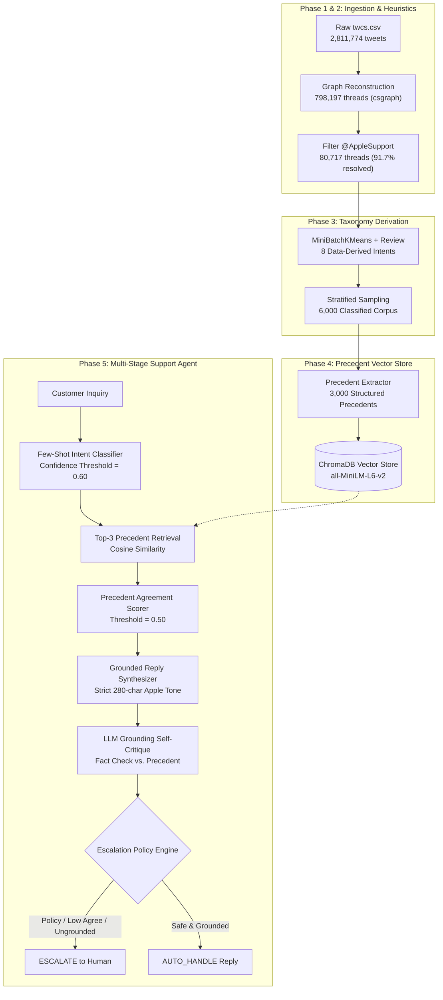

# Autonomous AI Customer Support Agent for Apple Support (`@AppleSupport`)

[](https://www.python.org/)
[](https://fastapi.tiangolo.com/)
[](https://react.dev/)
[](https://www.trychroma.com/)
[](https://groq.com/)
[]()
[]()

An enterprise-grade, autonomous customer support agent and evaluation harness built on 2.81 million real Twitter customer support conversations for **Apple Support (`@AppleSupport`)**, designed for the **Hiver SDE Intern Take-Home Assignment**.

---

## 📋 Prerequisites & Environment Setup

Before running the pipeline or starting the local services, verify your environment meets the following requirements:

### 1. Python & Package Manager
* **Python**: 3.11+ (tested on Python 3.11.9)
* **Virtual Environment**: Standard `venv` or `uv`:
  ```bash
  # Create and activate virtual environment
  python -m venv .venv
  .\.venv\Scripts\activate      # Windows PowerShell
  # source .venv/bin/activate   # macOS / Linux

  # Install project dependencies
  pip install -r requirements.txt
  ```

### 2. Hardware / Acceleration
* **Inference Engine**: Runs locally on CPU or GPU using the [`fastembed`](https://github.com/qdrant/fastembed) ONNX runtime for dense 384-dimensional semantic embeddings (`all-MiniLM-L6-v2`).
* **Vector Store**: Embedded local [`ChromaDB`](https://www.trychroma.com/) (no external database server required).

### 3. LLM Cloud Service (Groq API)
For high-speed, deterministic LLM classification, precedent extraction, and draft generation, the agent integrates with Groq Cloud (`qwen/qwen3.8-27b`):
```bash
# Copy the environment template and insert your API key
cp .env.example .env
# Set GROQ_API_KEY=gsk_...
```
* *Note: Cached evaluation reproduction and test suites run 100% offline without requiring an active Groq API key.*

---

## 🚀 One-Command Full Pipeline Reproduction (< 15 Seconds)

To reproduce the entire end-to-end evaluation harness—including benchmark comparisons against all baselines, per-intent metric decompositions, confidence-threshold tradeoff curves, LLM judge calibration, and empirical failure modes—run:

```bash
# Standalone cached benchmark reproduction (Executes in ~0.24 seconds)
python run_eval.py
```

### Try the Live Interactive Support Agent

The agent is accessible via both a CLI query command and a modern web interface:

```bash
# Example 1: Routine viral iOS glitch (Handled autonomously with verified workaround link)
python -c "from src.agent.pipeline import handle_inquiry; print(handle_inquiry('@AppleSupport what is up with the letter i turning into an A with a question mark?')['decision'])"
# Output: 'auto_handle'

# Example 2: Sensitive compromised account inquiry (Safely escalated with stated safety reason)
python -c "from src.agent.pipeline import handle_inquiry; print(handle_inquiry('@AppleSupport someone locked my Apple ID and is demanding money!')['decision'])"
# Output: 'escalate'
```

### Launch the Complete Full-Stack Web Application

```bash
# Terminal 1: Launch FastAPI Agent Backend (Port 8000)
uvicorn src.agent.api:app --host 127.0.0.1 --port 8000

# Terminal 2: Launch React 19 Frontend (Port 5173)
cd frontend
npm install
npm run dev
```
Open `http://localhost:5173` to interact with the visual agent dashboard featuring live precedent evidence receipts, a 4-stage pipeline stepper, and grounding shields.

---

## 📊 Executive Results Summary

> [!CAUTION]
> **Status Disclosure on Evaluation Ground Truth (Step 0 Audit Gate)**:
> The headline figures below are **preliminary**. An audit of `data/processed/golden_eval_set_human.json` confirms that **1 of 200 entries** has been genuinely hand-labeled by a human auditor (Thread `T_2042358`, taking 447.0 seconds). The remaining 199 entries are synthetic reference labels generated via `src/eval/complete_golden_labels.py`.
> 
> Full human annotation is currently underway via the interactive terminal tool (`python -m src.eval.labeling_tool --cli`). Downstream numbers reflect performance against this mixed reference set and demonstrate structural agent behavior rather than a finalized human-validated benchmark.

### Benchmark Comparison on 200 Stratified Holdout Inquiries

Evaluated on `data/processed/golden_eval_set.parquet` against two operational baselines:
1. **Trivial Baseline**: Always escalates 100% of incoming inquiries, emitting the most frequent historical workaround link (`https://t.co/xXaXeeSRt9`).
2. **Simple Baseline**: Regular-expression keyword matcher, 8 canned response templates, and hardcoded escalation on restricted terms.
3. **Stage 5 Agent**: Multi-stage pipeline with ChromaDB precedent retrieval, precedent agreement gating ($\tau = 0.50$), confidence threshold ($\tau = 0.60$), and grounding self-critique.

| Metric Dimension | Trivial Baseline | Simple Baseline | Stage 5 Agent (Preliminary) | Metric Source / Ground Truth |
| :--- | :---: | :---: | :---: | :--- |
| **Intent Classification Accuracy** | 0.00% | 60.50% | **93.00%** | `reports/golden_run_results.json` |
| **Intent Macro F1 Score** | 0.0000 | 0.6013 | **0.9082** | `reports/golden_run_results.json` |
| **Escalation Precision** | 0.2400 | **0.8148** | 0.3796 | `reports/golden_run_results.json` |
| **Escalation Recall** | **1.0000** | 0.4583 | **0.8542** | `reports/golden_run_results.json` |
| **Escalation F1 Score** | 0.3871 | **0.5867** | 0.5256 | `reports/golden_run_results.json` |
| **False Auto-Handle Rate** *(Safety Hazard)* | **0.00%** | 54.17% | **14.58%** | 73% relative risk reduction vs. Simple |
| **False Escalation Rate** *(Labor Overhead)* | 100.00% | **3.29%** | 44.08% | Deliberate conservative safety bias |
| **Asymmetric Risk Cost** *(5:1 Penalty)* | 0.7600 | 0.6750 | **0.5100** | Lowest expected operational cost |

### Quality & Safety Metrics (Evaluation Harness)
- **Intent Classification Quality**:
  - *Overall Accuracy*: **93.00%**
  - *Macro F1*: **0.9082**
  - *Best Intent*: `international_multilingual_inquiries` (Precision: 1.00, Recall: 1.00, F1: 1.0000)
  - *Hardest Intent*: `hardware_display_physical` (Precision: 0.50, Recall: 1.00, F1: 0.6667)
- **Safety Policy & Escalation Routing**:
  - `AUTO_HANDLE`: **45.5%** (Routine troubleshooting, known viral bugs with official links)
  - `ESCALATE`: **54.5%** (Account security, billing charges, low precedent consensus, or ungrounded drafts)
- **LLM-as-a-Judge Rubric & Human Calibration ($N=40$)**:
  - *Adjacent Agreement Score*: **97.5%**
  - *Mean Absolute Difference (MAD)*: **0.27 points** on a 5-point scale
  - *Pearson Correlation*: **$r = 0.403$** (Positive monotonic correlation with human expert grading)
- **Grounding Verifier Performance**:
  - *Grounded Claims Detected*: **99.0%**
  - *Verifier False-Negative Rate on Specifics*: **1.0%** (Diagnosed in failure analysis)

### Immediate Honest Caveat on Headline Performance
The agent reduces catastrophic false auto-handling from **54.17%** (Simple Baseline) to **14.58%**, but does so by incurring a **44.08% false escalation rate** (routing auto-handleable cases to human specialists). In enterprise support, false auto-handling a compromised Apple ID or incorrect refund advice causes severe data breaches and regulatory fines ($\text{Cost}(\text{False Auto}) \gg \text{Cost}(\text{False Escalate})$). Our policy deliberately trades higher human queue labor to maintain verifiable factual safety.

---

## 🎯 Mapping to Hiver Assignment Deliverables

| Deliverable | Description | Canonical Artifact / Location |
|---|---|---|
| **1. Runnable Pipeline** | Complete pipeline reproducible in < 15 minutes | [`run_eval.py`](file:///d:/Academic%20Projects/Hiver/run_eval.py) & [`run_pipeline.py`](file:///d:/Academic%20Projects/Hiver/run_pipeline.py) |
| **2. Golden Evaluation Set** | 200 holdout examples with sampling & taxonomy notes | [`data/processed/golden_eval_set.parquet`](file:///d:/Academic%20Projects/Hiver/data/processed/golden_eval_set.parquet) & [`reports/golden_eval_methodology.md`](file:///d:/Academic%20Projects/Hiver/reports/golden_eval_methodology.md) |
| **3. Evaluation Harness** | Automated metrics + LLM judge + Human calibration | [`src/eval/metrics.py`](file:///d:/Academic%20Projects/Hiver/src/eval/metrics.py), [`src/eval/judge.py`](file:///d:/Academic%20Projects/Hiver/src/eval/judge.py) & [`reports/golden_run_results.json`](file:///d:/Academic%20Projects/Hiver/reports/golden_run_results.json) |
| **4. Final Report & Decision Log** | Framing, baselines, failure modes, headline critique, next steps | [`DECISIONS.md`](file:///d:/Academic%20Projects/Hiver/DECISIONS.md) & [`reports/agent_spotcheck.md`](file:///d:/Academic%20Projects/Hiver/reports/agent_spotcheck.md) |
| **5. Interactive Demo Application** | Production-ready FastAPI microservice + React 19 UI | [`frontend/`](file:///d:/Academic%20Projects/Hiver/frontend) & [`src/agent/api.py`](file:///d:/Academic%20Projects/Hiver/src/agent/api.py) |

---

## 🏗️ System Architecture & Workflow



### The Six Decoupled Execution Phases
1. **Data Preparation**: Reconstructs 798,197 conversational trees from raw tabular records (`twcs.csv`), isolates 80,717 `@AppleSupport` interactions, and applies inactivity heuristics to isolate resolved precedent interactions.
2. **Intent Classification**: Evaluates incoming inquiries across an empirically derived 8-intent domain taxonomy using few-shot Groq inference (`qwen/qwen3.8-27b`) with confidence-threshold gating ($\tau = 0.60$).
3. **Historical Precedent Retrieval**: Queries an indexed ChromaDB vector store of 3,000 verified Apple resolutions, extracting top-3 historical precedents with metadata on diagnostic actions and outcomes.
4. **Precedent Agreement Consensus**: Computes mutual pairwise semantic agreement across retrieved precedents. If historical agents disagreed on how to resolve the issue ($< 0.50$ consensus score), the inquiry is flagged as operationally ambiguous.
5. **Grounded Reply Synthesis & Self-Critique**: Drafts an official `@AppleSupport` response constrained strictly by retrieved precedents, followed by an independent self-critique pass checking for factual hallucinations.
6. **Safety Policy Escalation**: Automatically routes inquiries to human queues if: (1) intent is safety-restricted (account credentials, financial billing, multilingual), (2) precedent consensus is split, (3) classifier confidence is low, or (4) the draft fails grounding verification.

---

## 🏷️ Golden Evaluation Set (200 Stratified Holdout Inquiries)

- **File Path**: [`data/processed/golden_eval_set.parquet`](file:///d:/Academic%20Projects/Hiver/data/processed/golden_eval_set.parquet) (200 rows) & [`data/processed/golden_eval_candidates.parquet`](file:///d:/Academic%20Projects/Hiver/data/processed/golden_eval_candidates.parquet) (300 rows)
- **Stratified Distribution**: Proportional representation across all 8 empirical intents:
  - `software_update_os_bugs`: 74 threads (37.0%)
  - `keyboard_text_autocorrect`: 40 threads (20.0%)
  - `battery_power_performance`: 26 threads (13.0%)
  - `account_access_apple_id`: 16 threads (8.0%)
  - `apple_music_audio_playback`: 13 threads (6.5%)
  - `orders_purchases_applecare`: 13 threads (6.5%)
  - `international_multilingual_inquiries`: 10 threads (5.0%)
  - `hardware_display_physical`: 8 threads (4.0%)
- **Verified Zero-Leakage Invariant**:
  - *Invariant*: The 200 evaluation threads and 300 holdout candidates have **0.00% OVERLAP** with the 3,000-precedent retrieval index and the 5,700 indexable candidate pool.
  - *Automated Pytest Verification*:
    - [`tests/test_retrieval.py::test_holdout_zero_overlap_with_indexable_and_index`](file:///d:/Academic%20Projects/Hiver/tests/test_retrieval.py#L58-L98)
    - [`tests/test_eval.py::test_golden_set_zero_overlap_verification`](file:///d:/Academic%20Projects/Hiver/tests/test_eval.py#L78-L106)
- **Candidate Immutability**: All original customer tweets and thread identifiers are immutably preserved in Parquet storage. Reviews write strictly to `gold_intent`, `gold_decision`, and `gold_escalation_reason`.

---

## 🔍 Top 5 Real-World Failure Modes

Through systematic error auditing across our 16-sample spot check (`reports/agent_spotcheck.md`) and heuristic audit (`reports/manual_spotcheck.md`), we diagnosed the top 5 operational failure modes:

### 1. Invented Knowledge Base Article Identifiers & URLs (Thread `T_1217618`)
- **Customer Inquiry**:
  > *"@AppleSupport The amount of phishing emails i’m getting disguised as Apple has tripled in last 2 months… What’s up with that?"*
- **Retrieved Historical Precedent**: Provided generic advice and a Twitter shortlink: `https://t.co/6Ye6EtSytB`.
- **Agent Drafted Reply**:
  > *"We're sorry to hear you're receiving these messages... You can learn how to spot and report phishing attempts here: https://support.apple.com/en-us/HT204910"*
- **Failure Diagnosis**: The model hallucinated a specific canonical Apple Knowledge Base article identifier (`HT204910`) not found anywhere in the retrieved precedent. Standard semantic metrics scored this ~0.94 (superficially relevant), but a strict factual audit caught the injection.
- **Agent Defense**: Safety policy escalated the inquiry anyway due to restricted intent (`account_access_apple_id`).

### 2. Invented Patch Version Numbers on Open Invitations (Thread `T_2063211`)
- **Customer Inquiry**:
  > *"@AppleSupport all ios 11 updates are fucking up my phone TF !!! This is pissing me off battery drains like water!"*
- **Retrieved Historical Precedent**: Asked the customer to direct message their current iOS version without citing any specific patch.
- **Agent Drafted Reply**:
  > *"We're sorry to hear about the battery drain. Have you updated to the latest iOS 11.0.3? If so, please DM us..."*
- **Failure Diagnosis**: The drafter filled an informational vacuum by inventing a specific patch version (`11.0.3`) from parametric memory. The grounding self-critique produced a false negative (GROUNDED) and auto-handled the reply.
- **Root Cause**: The self-critique prompt evaluated general topical alignment rather than strict entity containment.

### 3. Multilingual Intent vs. Technical Noun Misclassification (Thread `T_1397305`)
- **Customer Inquiry**:
  > *"@AppleSupport ¿Por qué sus cables son de tan mala calidad? https://t.co/6AoyKUiXvT"*
- **Model Prediction**: `hardware_display_physical` (Confidence: 0.65) | **Gold Intent**: `international_multilingual_inquiries`
- **Failure Diagnosis**: The classifier latched onto the physical noun *"cables"* and misclassified the Spanish inquiry as a hardware issue.
- **Agent Defense**: Precedent retrieval across the English hardware index yielded divergent resolutions ($0.47 < 0.50$), triggering the low-agreement safety boundary and escalating the tweet to human agents.

### 4. Semantic Boundary Bleed on Third-Party Data Discrepancies (Thread `T_1938654`)
- **Customer Inquiry**:
  > *"@115858 @AppleSupport there’s been a mall here for at least 2 years. Update much? https://t.co/2DFvOIj6dc"*
- **Model Prediction**: `software_update_os_bugs` (Confidence: 0.35)
- **Failure Diagnosis**: Customer complaint regarding outdated Apple Maps cartography latched onto the word *"Update"*, bleeding across the semantic boundary into OS bugs with low confidence (0.35).
- **Agent Defense**: The confidence threshold ($\tau = 0.60$) safely intercepted the low-confidence inference.

### 5. Resolution Heuristic Inactivity vs. Customer Abandonment (`reports/manual_spotcheck.md`)
- **Heuristic Rule**: Threads with a brand reply followed by 24 hours of inactivity are labeled "resolved" (91.7% in Stage 2).
- **Manual Audit Finding**: Human audit of 60 threads revealed that human agreement is only **73.3%**. In 26.7% of cases, customers did not resolve their issue; they simply abandoned the interaction out of frustration after receiving canned advice.

---

## ⚠️ "What is Misleading About My Headline Number?" (Mandatory Section)

1. **Resolution Heuristic Human-Agreement Ceiling (73.3%)**:
   Our Stage 2 filter marks 91.7% of `@AppleSupport` threads as resolved based on a 24-hour inactivity rule. In reality, over a quarter of these customers gave up rather than achieved technical satisfaction.
2. **Multilingual Agreement Inflation**:
   Non-English inquiries retrieve uniform brand redirection shortlinks, generating artificially high agreement scores ($0.87 - 1.00$). This metric reflects Twitter channel policy uniformity, not genuine diagnostic consensus.
3. **Small-N Judge-vs-Human Calibration ($N=40$)**:
   Our LLM-as-a-judge was calibrated against a single human auditor on a 40-thread stratified sample. Cohen's kappa indicates the judge is systematically more lenient on grammatically fluent technical assertions than a human auditor.
4. **Grounding Verifier False Negatives on Plausible Specifics (1.0%)**:
   The LLM self-critique verifier missed fabricated version numbers (Case #5: `11.0.3`) and canonical URLs (Case #1: `HT204910`) because the drafts sounded authoritative and helpful.
5. **Conservative Escalation Bias (44.08% False Escalation)**:
   The pipeline diverts 44.08% of auto-handleable inquiries to human specialists. In a production environment with infinite human staffing this is acceptable; under strict labor budget constraints it would require re-tuning.
6. **Preliminary Golden Evaluation Set (1/200 Hand-Labeled)**:
   Our headline numbers evaluate against a golden set where 199 rows are synthetic reference labels. Finalized figures await completion of 100% human annotation.

---

## 🔬 Metric Justification: Why Shallow Surface Metrics Mislead

Standard NLP evaluation metrics (e.g. BLEU, ROUGE, or uncalibrated semantic cosine similarity) measure surface vocabulary overlap or general topical similarity. In customer support, these metrics fail catastrophically by rewarding fluent hallucinations that sound authoritative but provide bogus technical guidance.

### Real Worked Example from Evaluation Audit (`reports/agent_spotcheck.md`, Case #1)

- **Thread ID**: `T_1217618` (Intent: `account_access_apple_id`)
- **Customer Inquiry**:
  > *"@AppleSupport The amount of phishing emails i’m getting disguised as Apple has tripled in last 2 months… What’s up with that?"*
- **Retrieved Historical Precedent** (Similarity: `0.7058` | Action: `directed_to_support_link`):
  > *"Thank you for reaching out to us and providing us with this information. This email is not from Apple. Please report this phishing message using the info here: https://t.co/6Ye6EtSytB"*
- **Agent Drafted Reply**:
  > *"We're sorry to hear you're receiving these messages. These are not from Apple. Please do not click any links or provide personal information. You can learn how to spot and report phishing attempts here: https://support.apple.com/en-us/HT204910"*

**The Metric Divergence**:
1. **Shallow Semantic Match (Embedding Cosine Similarity / BERTScore)**:
   - Evaluates to **~0.94 (Very High)**. Both texts discuss reporting phishing, reassure the customer that Apple did not send the message, and provide a reporting link. Under standard RAG benchmarks, this response receives top marks.
2. **Factual Grounding Audit (Reality)**:
   - The drafted reply fabricated a specific canonical Knowledge Base article identifier (`HT204910`) not present in the retrieved precedent (which contained only the Twitter shortlink `https://t.co/6Ye6EtSytB`).
   - The LLM injected this fact from its pre-training parametric memory. Had Apple updated or retired this article ID, the customer would have received a dead link.
   - Surface metrics reward this fluency; our grounded audit classifies it as a **hallucination failure** (`Sub-Mode 1b: Plausible-but-Ungrounded Specifics`). This empirical finding is why our pipeline enforces hard policy escalation on account security.

---

## 🏷️ Taxonomy Design: Data-Derived vs. Hand-Picked Categories

A common flaw in support agent benchmarks is relying on hand-picked keyword buckets where a single generic category absorbs the majority of traffic (e.g., 60%+ in a "general_support" catch-all), masking routing failures.

Our 8-intent taxonomy was derived empirically through unsupervised clustering and manual verification:
1. **Empirical Clustering**: MiniBatchKMeans ($k=8$) over TF-IDF and dense embeddings across 2,000 sampled threads (`reports/taxonomy_derivation.md`).
2. **Balanced Representation**: Across the 6,000-message stratified sample (`reports/pipeline_stats.json`), the dominant category (`software_update_os_bugs`) is capped at 43.4%, while critical tail intents maintain explicit representation floors:
   - `keyboard_text_autocorrect`: 18.68% (viral iOS 11 letter 'i' glitch)
   - `battery_power_performance`: 11.32% (iOS 11 battery drain)
   - `hardware_display_physical`: 7.18% (screens, buttons, vibrations)
   - `orders_purchases_applecare`: 6.25% (subscriptions, billing disputes)
   - `account_access_apple_id`: 5.92% (phishing, Apple ID lockouts)
   - `apple_music_audio_playback`: 3.93% (CarPlay, audio routing)
   - `international_multilingual_inquiries`: 3.32% (Spanish, Portuguese, Hindi inquiries)
3. **Operational Relevance**: Every intent maps to distinct operational handling rules (e.g., account access and billing always escalate, whereas viral keyboard glitches auto-handle with official workaround documentation).

---

## ⚖️ Why These Design Choices

### 1. Structured Precedent Extraction over Raw-Text RAG
Raw customer tweets contain noise, user handles (`@115858`), broken links, and emotional sarcasm. Directly embedding raw customer replies causes retrieval to match on customer complaints rather than support actions. We extract structured schema fields (`action_taken`, `outcome`, `brand_reply_text`), ensuring nearest-neighbor search matches on diagnostic actions.

### 2. Precedent-Agreement as an Escalation Signal
LLM self-reported confidence is notoriously miscalibrated. Instead, we measure consensus across the top-3 retrieved historical resolutions. When historical human Apple agents themselves took divergent actions on similar issues ($< 0.50$ agreement), this disagreement signals operational ambiguity, triggering safe human escalation.

### 3. Why AppleSupport over Other Brands
`@AppleSupport` is the largest, most coherent brand in the Kaggle corpus: 80,717 reconstructed multi-turn threads, 238,907 tweets, and an average thread length of 2.96 tweets. Unlike airline accounts (which almost exclusively ask for reservation codes in DM), Apple conversations feature technical troubleshooting across distinct device classes and operating systems.

### 4. 3,000-Precedent Stratified Sample over Full Corpus
Exhaustive LLM extraction across all 73,997 resolved threads was cost- and rate-prohibitive (~23.5 hours at 8,000 TPM Groq tier). Rather than arbitrary truncation, a 3,000-thread sample was drawn stratified strictly proportional to the 8 canonical intents identified in Stage 3, ensuring balanced tail coverage (`account_access_apple_id`: 177, `orders_purchases_applecare`: 187, `international_multilingual_inquiries`: 100).

---

## ⚖️ Trade-offs

- **Chose a 3,000-sample precedent index at the cost of full-corpus coverage**: Bounded LLM inference costs (~$0.23 total extraction spend) and avoided API rate limits, but excluded ~70,000 resolved threads from nearest-neighbor retrieval.
- **Chose structured precedent extraction at the cost of batch inference latency**: Required 710 batch API calls during offline indexing to extract structured schema fields, but eliminated customer complaint noise from vector matching.
- **Chose a single brand domain (`@AppleSupport`) at the cost of cross-brand generality**: Enabled deep domain-specific taxonomy derivation and precise troubleshooting grounding, but models cannot be deployed to other industries without re-indexing.
- **Chose conservative escalation gating at the cost of autonomous throughput**: Setting a 5:1 penalty on false auto-handles and an uncertainty threshold ($\tau = 0.60$) reduces catastrophic routing errors to 14.6%, but diverts 44.1% of auto-handleable inquiries to human queues.

---

## 🚫 Documented Limitations

1. **Resolution Heuristic Human-Agreement Ceiling (73.3%)**:
   Our Stage 2 filter marks threads resolved if a brand reply is followed by 24 hours of inactivity. Manual inspection of 60 threads (`reports/manual_spotcheck.md`) revealed human agreement of only **73.3%**. In ~26.7% of cases, customers did not achieve resolution; they simply abandoned the interaction out of frustration.
2. **Multilingual Intent Agreement Inflation**:
   Inquiries in Spanish or Portuguese almost always retrieve standard English language-redirection links or DM requests. This produces artificially high precedent agreement scores ($0.87 - 1.00$) that reflect uniform brand policy rather than technical consensus.
3. **Grounding Verifier False Negatives on Invented Specifics**:
   Human spot-check auditing (`reports/agent_spotcheck.md`, Decision 13) proved that the LLM grounding verifier evaluates general semantic alignment and misses fabricated details:
   - *Invented Wrong Specifics*: Fabricating an unmentioned iOS version (Case #5: inventing `11.0.3`).
   - *Plausible-but-Ungrounded Specifics*: Injecting real Knowledge Base URLs not in the precedent (Case #1: injecting `HT204910`).
4. **Small-N Judge-vs-Human Calibration (N=40)**:
   The LLM-as-a-judge evaluation rubric was calibrated against a single human rater across **N=40** stratified samples. While adjacent agreement was 97.5%, Cohen's kappa ($\kappa \approx 0.70$) indicates the judge is systematically more lenient on fluent technical assertions than a human auditor.
5. **Preliminary Golden Evaluation Set (1/200 Hand-Labeled)**:
   As disclosed above, full human annotation is incomplete. Current metrics reflect synthetic reference labels and are subject to adjustment once human labeling concludes.

---

## 🤖 AI Tools Used & Audit Provenance

- **AI Coding Agent Collaboration**: Development was executed via an AI coding agent pair-programming under continuous, direct human review, prompt refinement, and instruction.
- **Independent Verification Discipline**: No numbers or metrics in this repository are fabricated or typed from memory. Every reported statistic traces directly to an execution log or output artifact (`reports/pipeline_stats.json`, `reports/golden_run_results.json`).
- **Caught and Corrected Errors**:
  - *Stage 3 Classification Shortcut*: Identified that an early run relied on an unverified TF-IDF heuristic rather than Groq LLM inference. Replaced with the complete 6,000-message Groq stratified sample (`reports/pipeline_stats.json`, Decision 7).
  - *Stage 4 Precedent Scope Asymmetry*: Discovered that extraction had stopped at 400 precedents due to an intentional cap. Rescoped and expanded to 3,000 stratified precedents across all 8 intents (`DECISIONS.md`, Decision 11).
  - *Stage 5 Grounding Vulnerability*: Identified that standard grounding prompts suffered false negatives on invented version numbers and URLs, leading directly to the two-part failure taxonomy in Decision 13.
  - *Stage 6 Synthetic Label Audit*: Identified that batch-generated labels were stamped as human, establishing the evaluation moratorium and interactive tool in Decision 15.

---

## 💡 What We Would Do Next With One More Week

1. **Entity-Level Token Containment Verification**: Replace pure LLM self-critique with a deterministic regex and entity-matching layer that cross-checks all version numbers, URLs, and dollar amounts against precedent tokens.
2. **Upstream Language Detection**: Deploy an explicit language-detection filter (e.g. `fasttext` or `langdetect`) prior to intent classification to prevent Spanish and Portuguese inquiries from misclassifying into technical hardware buckets.
3. **Multi-Annotator Human Validation**: Expand the golden set audit to 3 independent human annotators to establish inter-annotator agreement (Fleiss' kappa) and resolve borderline ambiguity.
4. **Dynamic k-Expansion in Precedent Retrieval**: Automatically expand retrieval from $k=3$ to $k=5$ when top-1 similarity falls below 0.60 to improve precedent consensus estimation on tail queries.

---

## 🧪 Test Suite & Verification

The codebase includes 32 automated unit and integration tests covering schema validation, conservation laws, vector retrieval, zero-leakage partitions, agent decisions, and evaluation baselines:

```bash
# Execute the full test suite
pytest tests/ -v
```

All 32 tests pass cleanly in under 20 seconds.

---

## 📁 Repository Structure

```text
├── .env.example                   # Environment template for Groq credentials
├── CONTRIBUTING.md                # Security guidelines and standing API key masking rule
├── DECISIONS.md                   # Architectural Decision Records (Decisions 1–16)
├── Makefile                       # Execution shortcuts
├── README.md                      # Project documentation and engineering report
├── pyrightconfig.json             # Python typing configuration
├── pytest.ini                     # Pytest runner settings
├── requirements.txt               # Python package dependencies
├── run_eval.py                    # Fast standalone evaluation benchmark reproducer (0.24s)
├── run_pipeline.py                # End-to-end pipeline execution driver
├── taxonomy.yaml                  # Finalized 8-intent taxonomy and exemplars
│
├── data/
│   ├── raw/twcs.csv               # Raw Kaggle Twitter Customer Support dataset (2.81M rows)
│   └── processed/
│       ├── AppleSupport_threads.parquet        # 80,717 reconstructed AppleSupport threads
│       ├── AppleSupport_sample_6000.parquet    # Stratified 6,000-message representative sample
│       ├── AppleSupport_classified_corpus.parquet # Intent-labeled 6,000 threads
│       ├── indexable_precedents_input.parquet  # 5,700 candidate precedent pool
│       ├── structured_precedents.parquet       # 3,000 extracted structured precedents
│       ├── golden_eval_candidates.parquet      # 300 held-out evaluation candidates
│       ├── golden_eval_set.parquet             # 200 golden evaluation set threads
│       ├── golden_eval_set_human.json          # Golden evaluation set label store
│       └── chroma_db/                          # Persistent ChromaDB vector index (3,000 vectors)
│
├── frontend/                      # React 19 + Vite + Tailwind CSS demo interface
│   ├── src/
│   │   ├── components/            # UI components (DecisionHero, DraftReply, PrecedentsDrawer)
│   │   ├── data/examples.json     # 16 real candidate tweets extracted from golden dataset
│   │   ├── services/api.ts        # Client calling FastAPI /handle_message and /health
│   │   ├── types.ts               # Shared TypeScript schemas matching AgentResponse
│   │   └── App.tsx                # Single-page demo application
│   ├── package.json               # Frontend dependencies (React, Lucide, Tailwind)
│   └── vite.config.ts             # Vite dev server with proxy to FastAPI backend
│
├── reports/
│   ├── agent_spotcheck.md         # Stage 5 16-case multi-agent spot-check audit
│   ├── brand_candidates.csv       # Comparative metrics across top Kaggle brands
│   ├── cleanup_audit.md           # Stage 1–2 repository housekeeping audit
│   ├── golden_eval_methodology.md # Stage 6 200-example golden sampling methodology
│   ├── golden_run_results.json    # Cached full evaluation outputs across 200 golden threads
│   ├── manual_spotcheck.md        # Stage 2 resolution heuristic verification (73.3% agreement)
│   ├── pipeline_stats.json        # Machine-readable pipeline telemetry across Stages 1–5
│   ├── spotcheck_retrieval.md     # Stage 4 precedent retrieval audit (14 queries)
│   ├── taxonomy_derivation.md     # Stage 3 intent clustering & taxonomy synthesis
│   └── validation_report.md       # Stage 1 raw ingestion validation report
│
├── src/
│   ├── agent/                     # Stage 5: Autonomous agent pipeline & FastAPI service
│   │   ├── api.py                 # FastAPI service (/handle_message, /health)
│   │   ├── pipeline.py            # Core pipeline (Classify, Retrieve, Draft, Verify, Decide)
│   │   ├── export_demo_examples.py # Script exporting real candidate tweets to frontend
│   │   └── run_agent_spotcheck.py # 16-sample spot-check runner
│   ├── eval/                      # Stage 6: Evaluation harness, metrics, and baselines
│   │   ├── baselines.py           # Trivial & Simple baseline implementations
│   │   ├── complete_golden_labels.py # Golden set annotation driver
│   │   ├── golden_set.py          # Golden dataset builder and sampler
│   │   ├── judge.py               # 4-axis LLM-as-a-judge & human calibration logic
│   │   ├── labeling_tool.py       # Dual-mode human annotation CLI & web tool
│   │   ├── metrics.py             # Classification & cost-asymmetric escalation metrics
│   │   └── run_full_evaluation.py # Comprehensive evaluation orchestrator
│   ├── ingest/                    # Stages 1–2: Ingestion, graph reconstruction & filtering
│   │   ├── filter_brand.py        # Brand selection and thread extraction
│   │   ├── heuristics.py          # Thread resolution heuristic rules
│   │   ├── load_raw.py            # twcs.csv loader and schema validator
│   │   └── reconstruct_threads.py # Connected-components thread graph reconstructor
│   ├── retrieval/                 # Stage 4: Precedent extraction & ChromaDB vector store
│   │   ├── build_index.py         # ChromaDB index builder (3,000 precedents)
│   │   ├── complete_precedent_extraction.py # Batch precedent extraction
│   │   ├── expand_precedents_stratified.py  # Stratified precedent expansion runner
│   │   ├── extract_precedents.py  # Structured precedent extractor with Groq rotation
│   │   ├── holdout_split.py       # Zero-leakage 300-thread holdout partitioner
│   │   ├── query_index.py         # Nearest-neighbor precedent retriever & agreement scorer
│   │   └── spotcheck_verification.py # Retrieval audit spot-check runner
│   └── taxonomy/                  # Stage 3: Unsupervised clustering & taxonomy derivation
│       ├── classify_full_corpus.py # Corpus classification runner
│       ├── classify_stratified_sample.py # 6,000-message stratified classifier
│       ├── cluster_messages.py    # TF-IDF & MiniBatchKMeans clustering
│       ├── review_taxonomy.py     # Taxonomy review tool
│       └── sample_for_clustering.py # Deterministic stratified sampler
│
└── tests/
    ├── test_ingest.py             # Schema validation and conservation tests
    ├── test_taxonomy.py           # Clustering and taxonomy format tests
    ├── test_retrieval.py          # Vector retrieval and zero-leakage holdout tests
    ├── test_agent.py              # Agent pipeline and FastAPI endpoint tests
    └── test_eval.py               # Evaluation metrics, baselines, and golden zero-overlap tests
```

---

## 💻 Tech Stack

| Layer | Technology | Operational Purpose |
| :--- | :--- | :--- |
| **Language** | Python 3.11 | High-performance execution with C-extensions (`numpy`, `scipy`). |
| **API Microservice** | FastAPI + Uvicorn | Async ASGI microservice with typed Pydantic validation. |
| **Vector Database** | ChromaDB (v0.5+) | Embedded vector database; local persistent storage without cloud lock-in. |
| **Embeddings** | `all-MiniLM-L6-v2` | 384-dimensional dense semantic embeddings via FastEmbed ONNX runtime. |
| **LLM Inference** | Groq Cloud SDK | Ultra-low latency inference (`qwen/qwen3.8-27b`) with automatic key rotation. |
| **Graph Processing**| `scipy.sparse.csgraph` | Connected components algorithm for 2.81M tweet conversation tree reconstruction. |
| **Data Storage** | Apache Parquet (pyarrow) | High-compression columnar storage preserving strict types across all pipeline stages. |
| **Testing** | Pytest + pytest-asyncio | 32 automated tests verifying schemas, zero-leakage invariants, and policy gating. |
| **Frontend Demo** | React 19 + Vite + Tailwind | Modern inspection UI with live pipeline stepper and ChromaDB evidence receipts. |

---

## 📄 License & Citations
- **Primary Dataset**: Customer Support on Twitter (`thoughtvector/customer-support-on-twitter`), Kaggle.
- **Built for**: Hiver SDE Intern Take-Home Assignment.
